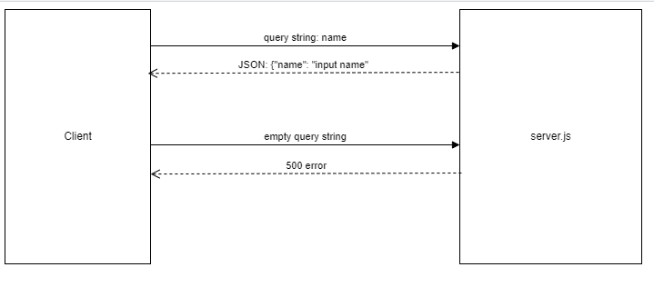

# LAB - Class 02

## Project: Basic Express Server

### Author: Brady Davenport

### Problem Domain

Create an Express server with with a `/person` route.  A user will prompted for an input, and the return should be an JSON object
  `{"name": "fred"}`

The server should include tests that ensure appropriate error handling (i.e. 404, 500, etc).

Engineering Note - Testing servers without side-effects is crucial. More critical is not having to manage starting/stopping a server in multiple environments.

### Links and Resources

- [Prod url]()
- [GitHub Repo](https://github.com/bradydavenport/basic-express-server)

### Setup

#### `.env` requirements

- `PORT` - Port Number

#### How to initialize/run the application

- `nodemon`
- Endpoint: `/`
  - Returns

#### How to use the library

#### Features / Routes

- GET : `/hello` -

#### Tests

`npm test` in the terminal will test the `get` routes, ensuring they respond with the correct statuses and messages

#### UML

(Created with [Diagrams](https://app.diagrams.net/))

